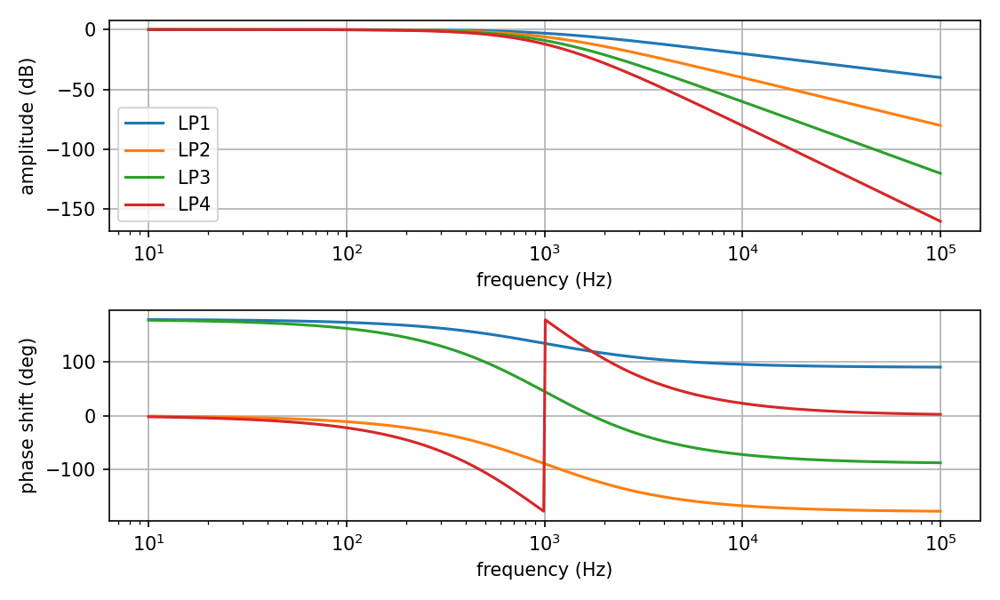
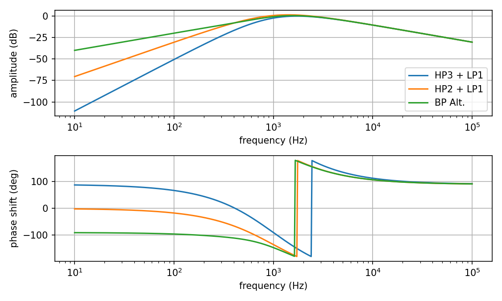
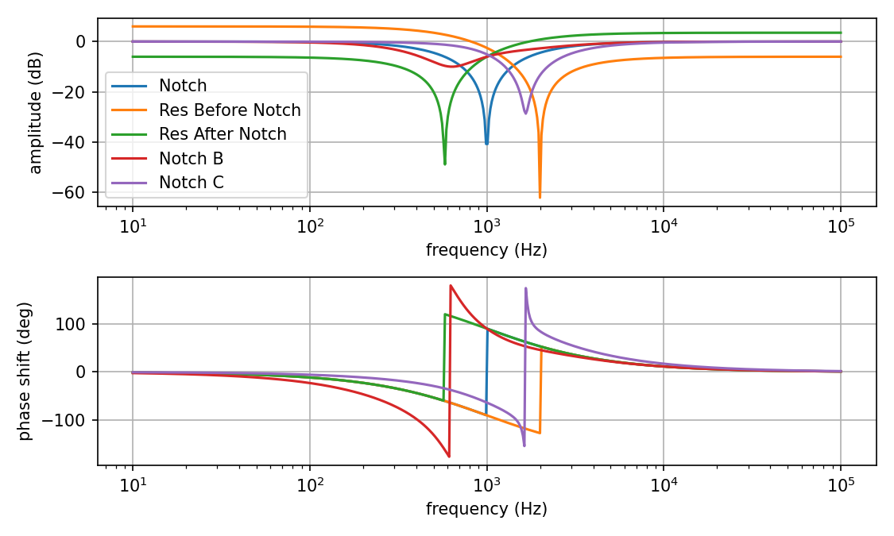
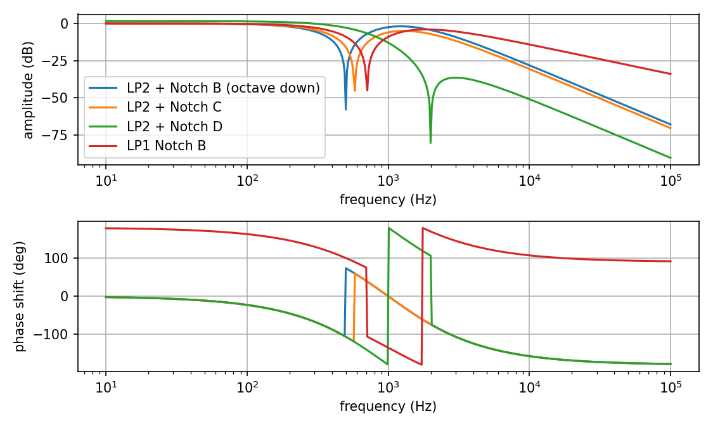
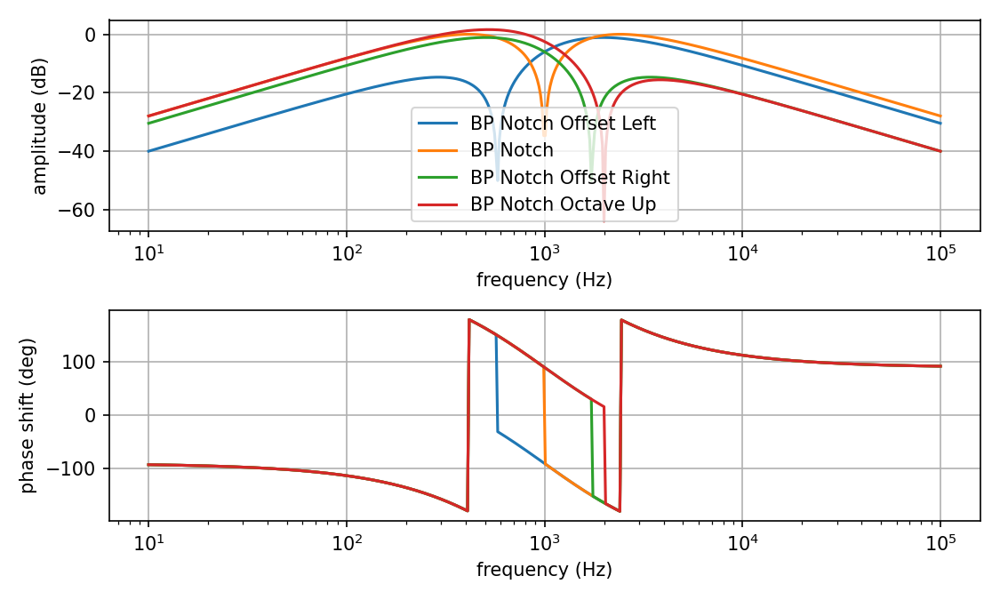
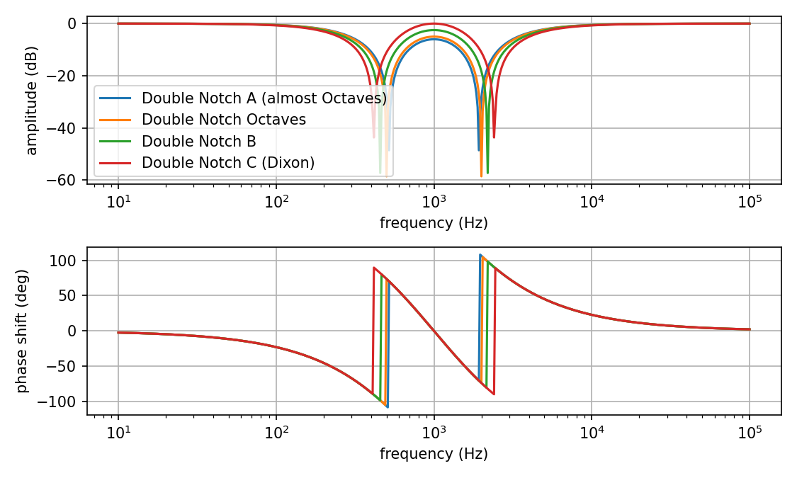

# Catalog

Coefficients and names from [https://expeditionelectronics.com/Diy/Polemixing](https://expeditionelectronics.com/Diy/Polemixing)

* [0, 1, 0, 0, 0] LP1
* [0, 0, 1, 0, 0] LP2
* [0, 0, 0, 1, 0] LP3
* [0, 0, 0, 0, 1] LP4
* [0, 0, 0, 3, 3] HP1 + LP3
* [0, 0, 3, 3, 0] HP1 + LP2
* [0, 2, 2, 0, 0] BP2
* [0, 0, 4, 8, 4] BP4
* [0, 3, 9, 9, 3] HP3 + LP1
* [0, 3, 6, 3, 0] HP2 + LP1
* [0, 3, 6, 4, 1] BP Alt.
* [1, 1, 0, 0, 0] HP1
* [1, 2, 1, 0, 0] HP2
* [1, 3, 3, 1, 0] HP3
* [1, 4, 6, 4, 1] HP4
* [1, 2, 2, 0, 0] Notch
* [.5, 1, 2.5, 0, 0] Res Before Notch
* [1.5, 3, 2, 0, 0] Res After Notch
* [1, 2, 2, 2, 2] Notch B
* [1, 3, 6, 4, 1] Notch C
* [0, 1, 2, 2, 0] LP1 + Notch A
* [0, 4, 8, 5, 0] LP1 + Notch B (octave down)
* [0, 3, 6, 4, 0] LP1 + Notch C
* [0, 0, 1, 2, 2] LP2 + Notch A
* [0, 0, 4, 8, 5] LP2 + Notch B (octave down)
* [0, 0, 3, 6, 4] LP2 + Notch C
* [0, 0, .3, .6, 1.5] LP2 + Notch D
* [0, 2, 4, 3, 0] LP1 Notch B
* [0, 3, 9, 10, 4] BP Notch Offset Left
* [0, 4, 12, 16, 8] BP Notch
* [0, 1, 3, 6, 4] BP Notch Offset Right
* [0, 1, 3, 7, 5] BP Notch Octave Up
* [1, 3, 4, 2, 0] HP + Notch A
* [1, 3, 6, 4, 0] HP + Notch B
* [1, 4, 7, 6, 2] HP2 + Notch A
* [1, 4, 8, 8, 3] HP2 + Notch B
* [1, 4, 9, 10, 4] HP2 + Notch C
* [1, 4, 10, 12, 5] HP2 + Notch D
* [1, 4, 10, 12, 6] Double Notch A (almost Octaves)
* [1, 4, 10.25, 12.5, 6.25] Double Notch Octaves
* [1, 4, 11, 14, 7] Double Notch B
* [1, 4, 12, 16, 8] Double Notch C (Dixon)
* [1, 4, 14, 20, 10] Double Notch D
* [1, 4, 15, 22, 11] Double Notch (approx. 3rd Harmonic)
* [.1, .6, 1.1, 2.8, 3.2] 20db LP shelf

