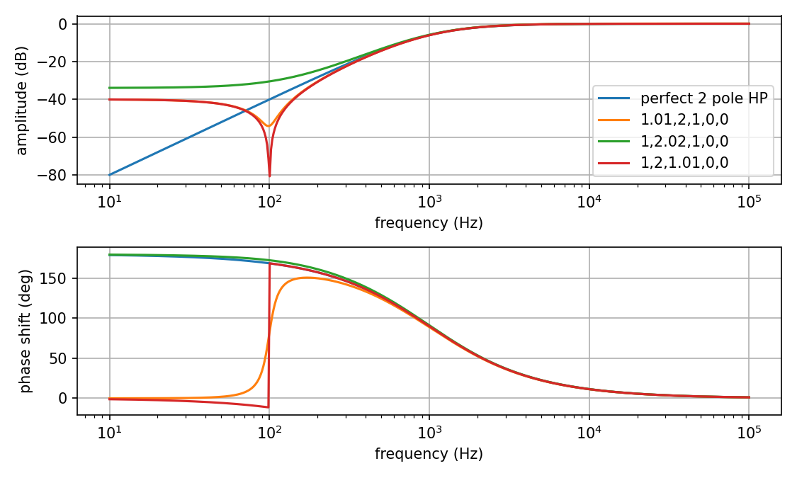
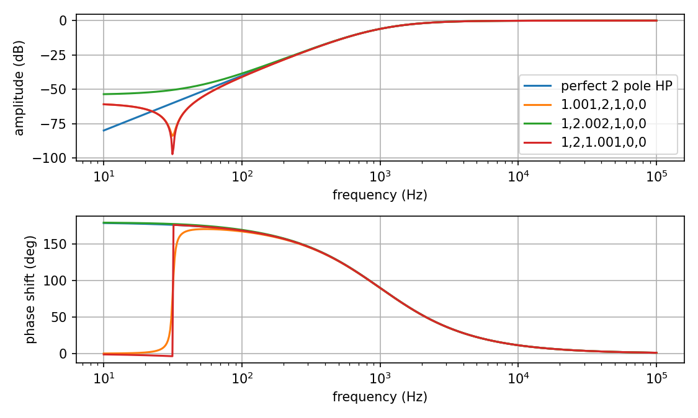
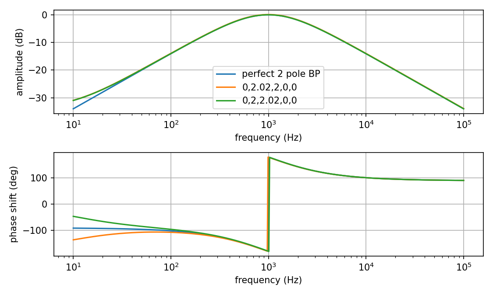
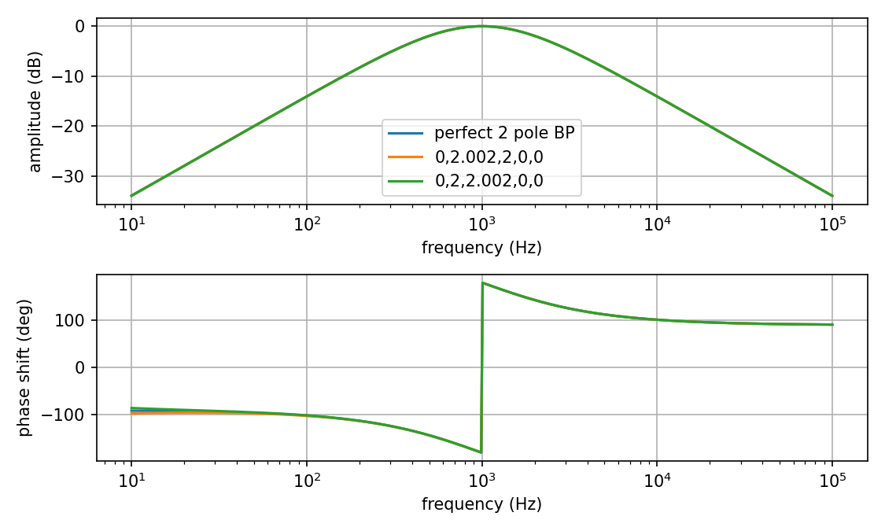

# Notes on cancellation and tolerances

How do you get a high pass filter, or band pass, or any filter that goes to zero amplitude output at zero frequency, with a combination of low pass filters? Answer: By cancellation. Two of the poles are inverted and their contribution cancels that of the other poles and input. For example, a 1 pole HP is input minus 1 pole LP. At low frequency these are supposed to be equal magnitude and phase and their difference is zero.

But that means sensitivity to errors. Quoting the Electric Druid page, "These are proper mixed responses that need careful matching of the outputs. If the outputs are not well matched, the cancellation of the signal in the stop band will not be good, and you’ll have a highpass filter with some “leakage” of low frequencies. For musical use, this may well not be that important."

Looking at the [formulas](https://expeditionelectronics.com/Diy/Polemixing/math), we see there's a term in the real part of the numerator equal to A-B+C-D+E. With [1, 4, 6, 4, 1] this equals 0. But suppose there is a 1% error in the third coefficient? With [1, 4, 6.06, 4, 1] this becomes 0.06, which then is the dominant term in the numerator at low frequency. So instead of the amplitude going to zero at DC, it levels off at 6% of the input amplitude.

In addition, at nonzero frequency, if the error causes a sign change, this corresponds to a 180° phase flip at that frequency.

Below are Bode plots for a perfect 4-pole high pass filter, with coefficients [A, B, C, D, E] = [1, 4, 6, 4, 1], and filters with each coefficient changed by 1%. The corner frequency is 1 kHz.

Note how with an error in the second or fourth coefficient, in addition to the leveling off of the amplitude at DC, the phase flips 180° at around 300 to 500 Hz.

Even with a 0.1% error the amplitude below about 200 Hz is significantly higher than with perfect coefficients, though probably not large enough to be objectionable in most situations. The phase flip occurs about 200 Hz, and may or may not be important at this small amplitude if mixing with other signals of the same frequency.

For the lower order HP filters the same thing happens but the sensitivity at DC to exact coefficients is lower. With 1% error the effect on the amplitude is pretty much negligible down to 10 Hz for 1-pole HP, though the change in phase is much bigger.

With 0.1% errors the changes are certainly negligible:

However, things get worse with the 2-pole HP. Here there is a leveling off below about -35 dB and a phase inversion at 100 Hz with a 1% error in the first or third coefficient.

With 0.1% errors the phase inversion moves down to about 30 Hz:

Similarly for the band pass filters. 2-pole, 1% errors is okay:

and 2-pole, 0.1% errors is fine:

But 4-pole, 1% errors is trouble:

while 4-pole, 0.1% errors is good at audible frequencies (with 1kHz corner):

These plots illustrate cases where *one* coefficient is inaccurate, but in reality all five are likely to vary randomly if randomly chosen resistors are used in the mixers. 1% tolerance is probably not good enough, at least for higher order high pass and band pass filters. Hand matching resistors at more like the 0.1% level is recommended.

The filter gains, too, should be calibrated to be unity with high precision. But in fact the gains vary over the range of the frequency control voltage by as much as ~2%. However, these shifts are correlated: All stages experience approximately the same size shift in the same direction. Then the gain errors in the even stages (with positive coefficients in the pole sums) tend to cancel those in the odd stages (with negative coefficients). In addition most of the gain shift occurs at higher, less useful values of the control voltage. So as long as the stages are calibrated to unity gain at moderate control voltage, the effects of the gain shift should generally be quite tolerable.