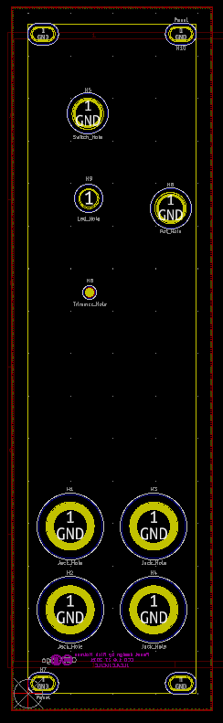
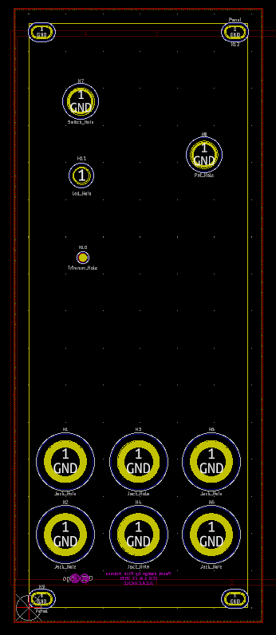
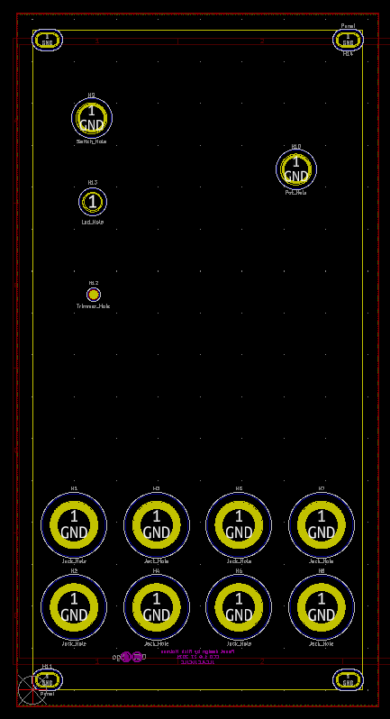

# Kosmo_panel

KiCad footprint library and templates for Kosmo panels

## Footprints

* Kosmo_Encoder_Hole
* Kosmo_Jack_Hole
* Kosmo_Jack_Hole_horizontal
* Kosmo_LED_Hole
* Kosmo_Panel_Dual_Mounting_Holes
* Kosmo_Panel_Dual_Slotted_Mounting_Holes
* Kosmo_Panel_Mounting_Hole
* Kosmo_Panel_Slotted_Mounting_Hole
* Kosmo_Pot_Hole
* Kosmo_Slide_pot_Alpha_60mm
* Kosmo_Switch_Hole
* Kosmo_Trimmer_Pot_Hole
* Little_Jack_Hole
* OLED_128x64
* Push_Button_A-3487

## Templates

* Kosmo_25mm
* Kosmo_50mm
* Kosmo_75mm
* Kosmo_100mm

   

## Note
As of release v1.1 KiCad files are in KiCad 6 format. If you are using KiCad 5 you must use the v1.0 release.
