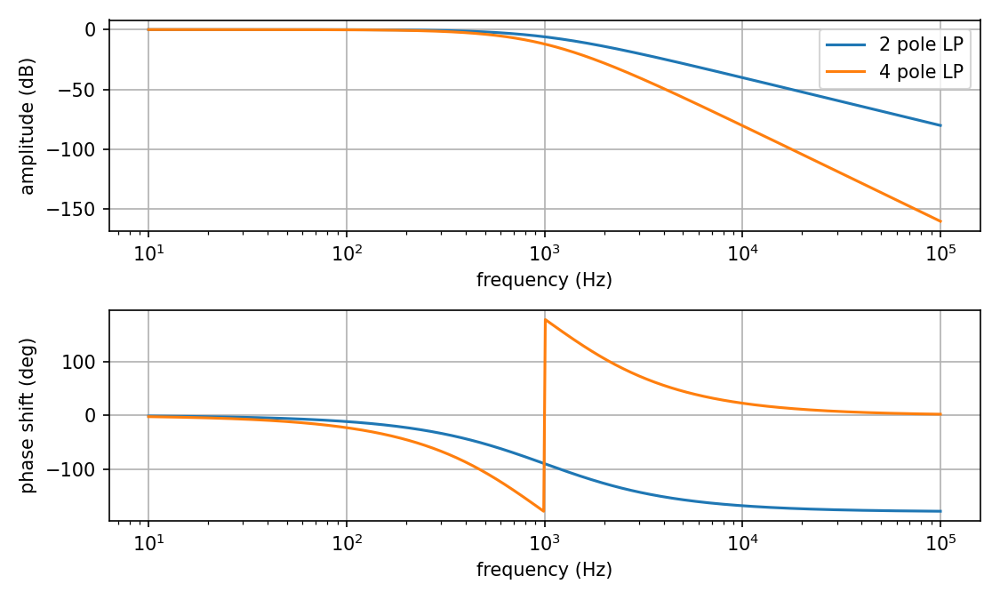

# Pole mixing filter

This is a multimode VCF in Kosmo format based on a [design](https://electricdruid.net/multimode-filters-part-2-pole-mixing-filters) by Electric Druid (ED). It uses pole mixing to achieve multiple filter behaviors.

## Design notes

### Changes from ED design

* 82k resistors (RF) changed to 100k; 91k resistors (RC) to fixed + trimmer.
* Added AC coupling capacitor on input signal to resonance compensation mixer.
* Added resistor on resonance input pin missing from original schematics. Changed its value from 51k to 120k.
* Added op amp buffers and pulldown resistors on LP1–4 after AC coupling capacitors.
* Added second inverting stage on input. Reduced first stage gain to 0.51 and increased output stage gain by the same factor.
* Changed ordering of 1st to 6th mixes.
* In 4P HP mix, changed 4.99k resistor to sum of 2k and 3k.
* Changed BP resistors for unity gain at peak.
* Changed 7th mix to {1, 2, 2, 0, 0} notch.
* Original had incorrect resistances for 8th mix; fixed.
* 7th and 8th mix have enough resistor footprints to implement any desired mix.
* Multiplexer replaced with rotary switch.
* Added header for expansion.

### Discussion

As discussed [here](Docs/tolerances.md), it is important that filter stages have unity DC gain and mixer ratios be correct at a level of about 1% or better, preferably more like 0.1% for the mixer resistors.

The 82k feedback resistors used in the ED design are a puzzle: Per the CEM3320 datasheet, they result in a gain of around 0.82. In the datasheet circuit these resistors are 100k giving gain 0.999. On the breadboard I found some gain variation (even if I matched the resistors), so I replaced the 91k resistors (RI, RC) with fixed + trimmer combinations.

If there is a DC offset on the input signal (if for instance it goes 0 to 5 V), then, due to its being DC coupled to the resonance compensation mixer, turning up the resonance CV would drive the DC offset of the output signal higher. Even with a 0 to 2 V input, the output could exceed 9 V due to the large offset. This is too large: With Vcc = 12 V, maximum output before clipping is about 9 V. Adding a capacitor to AC couple the input signal to the compensation mixer eliminates this problem.

The ED schematics omit a resistor on the resonance input pin. In the comments Tom Wiltshire says this should be 51k. I found this value would cause self oscillation to start up at a very low position of the resonance knob, so changed it to 120k.

With an input of 5 V (or -5 V) or above, the filter stage outputs would try to go to or above about 10 V. I reduced the input gain by a factor of 0.51 to keep below that limit. ±5 V is the standard audio signal range in my synth. Of course if you use two summed inputs they might exceed 5 V, so some additional attenuation may be needed. I also added a second inverting stage with the thought of preserving the phase going into the filter. However there is an inverting stage at the output, so it probably would have been better to leave this second stage out. Not quite sure what I was thinking!

ED's mixers have been re-ordered, just because I felt 2 pole should go before 4 pole. The E96 4.99k resistor has been replaced by E24 2k and 3k in series, because who want to order one resistor from DigiKey that Tayda doesn't carry? The resistor values used by ED in the BP mixers result in peak amplitudes 6 or 12 dB below the input level; I reduced them to get unity gain at the peaks. I wasn't that enthusiastic about the seventh filter — a rather weird combination of things giving rise to a sort of band pass plus notch response — so I replaced it with a second (sharper, deadlier) notch filter.

I didn't see much point in messing around with a multiplexer chip. I used a rotary switch instead. If you really want electronically selectable filter shapes, see the Expansion section below.

The mixers that are not selected by the rotary switch had floating outputs and corrupted the LP1–LP4 signals until I added op amp buffers after the AC coupling capacitors. I believe the same problem would occur with a multiplexer. To avoid bias current charging of the capacitors, I also added 1M resistors to ground between the capacitors and the op amps.

### Choose your own

To accommodate other builders with other preferences (or future me with other preferences), in the last two filters enough resistor (or jumper) footprints have been provided to build almost any mixer allowing whatever filter responses you want. Each of the LP1, LP2, LP3, and LP4 signals has two footprints in series. For example, to re-create ED's seventh filter, [0, 1, 3, 6, 4]: Omit the RIN resistor, use 30k and a wire jumper for the two RLP1 resistors, 10k+jumper for RLP2, 2k+3K for RLP3, and 7.5k+jumper for RLP4. To build the filters shown in the schematic, follow the silkscreen: Use wire jumpers for the jumper footprints and leave the DNF footprints empty.

A catalog of 40+ filters is in [Docs/catalog.md](Docs/catalog.md).

### Expansion

There is an expansion header on the PCB. This could be used to mount a daughterboard giving more mixes. Or it could be used for a ribbon cable connection to an expansion module, which could e.g. provide user-changeable mixes (5 rotary switches?) or a microcontroller-based variable mixer, potentially even with CV input to switch mixes. This repo includes a design for a daughterboard providing four additional builder-defined mixes. As with filters 7 and 8 on the main module, there are two footprints for each of the LP1, LP2, LP3, and LP4 signals and you can populate both with resistors, use one resistor and one jumper, or omit both to get the mixes you desire. This daughterboard has not been built or tested yet.

### Filters

The filters are as follows. Numbers indicate coefficients for input, -LP1, LP2, -LP3, and LP4 mixing.

* 0, 0, 1, 0, 0 — 2 pole low pass
* 0, 0, 0, 0, 1 — 4 pole low pass
* 1, 2, 1, 0, 0 — 2 pole high pass
* 1, 4, 6, 4, 1 — 4 pole high pass
* 0, 2, 2, 0, 0 — 2 pole band pass
* 0, 0, 4, 8, 4 — 4 pole band pass
* 1, 2, 2, 0, 0 — Notch A
* 1, 2, 2, 2, 2 — Notch B

Here are Bode plots for these filters:

### Cancellation and tolerances

See discussion [here](Docs/tolerances.md).

## Software

The plots above were produced with a Python script included in this repo's Software folder. For a usage example see plots.sh in that folder. Libraries matplotlib, numpy, sys, and re are required. 

For the formulas for pole mixing upon which these plots are based, see [https://expeditionelectronics.com/Diy/Polemixing/math](https://expeditionelectronics.com/Diy/Polemixing/math). I believe there are some errors: the formulas for the imaginary parts of the numerator and denominator should have the opposite sign.

## Current draw
? mA +12 V, ? mA -12 V

## Photos

## Documentation

* [Schematic](Docs/pmf_schematic.pdf)
* PCB layout: [front of board 1](Docs/Layout/pmf_B1/pmf_B1_front.svg), [back of board 1](Docs/Layout/pmf_B1/pmf_B1_back.svg), [front of board 2](Docs/Layout/pmf_B2/pmf_B2_front.svg), [back of board 2](Docs/Layout/pmf_B2/pmf_B2_back.svg)
* [BOM](Docs/BOM/pmf_bom.md)
* [Daughterboard schematic](Docs/pmf_daughter_schematic.pdf)
* Daughterboard PCB layout: [front](Docs/Layout/pmf_daughter/pmf_daughter_front.svg), [back](Docs/Layout/pmf_daughter/pmf_daughter_back.svg)
* [Daughterboard BOM](Docs/BOM/pmf_daughter_bom.md)
* [Blog post](https://analogoutputblog.wordpress.com/2023/05/04/pole-mixing-filter/)

## GitHub repository

* [https://github.com/holmesrichards/pmf](https://github.com/holmesrichards/pmf)
